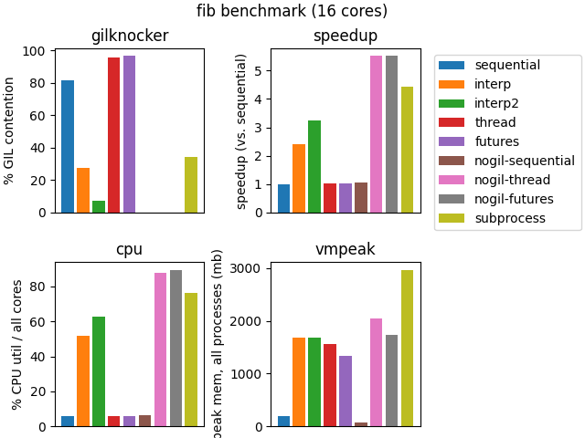
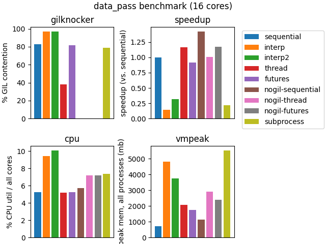
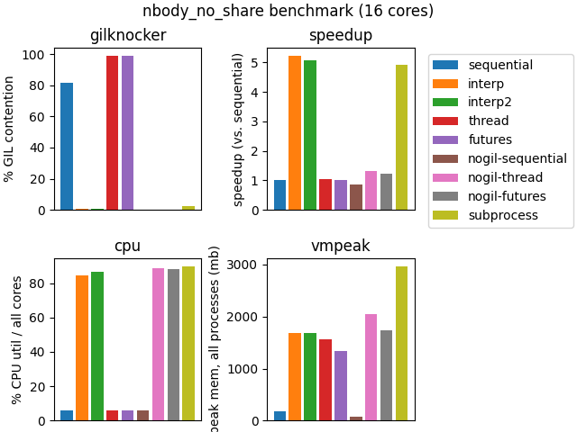

# Pool party 🏊

Experiments with building a `multiprocessing.pool.SubinterpreterPool` out of the
per-interpreter GIL support in Python 3.12. Also comparing to alternative
approaches, including `multiprocessing.ThreadPool`, `multiprocessing.Pool`,
`concurrent.futures.ThreadPoolExecutor`, with and without `nogil`.

## Benchmarks

All of these benchmarks compute the same thing X number of times, either
sequentially or in a pool of 16 workers on a 8 core / 16 virtual core machine.

### fib

Calculates fibonacci(28) 64 times.  Taken directly from the [nogil README](https://github.com/colesbury/nogil#example).



### nbody

The `nbody` benchmark from pyperformance, doing 10 iterations each time, 64 times.


### raytrace

The `raytrace` benchmark from pyperformance.  Renders a 100x100 image, 64 times.


### data_pass

A do-nothing benchmark that passes 0.5 MB of data 64,000 times to measure the
overhead of message passing.



## Metrics

### gilknocker

Uses the [gilknocker](https://pypi.org/project/gilknocker/) library, which
reports the percentage of samples in which the GIL was held. A rough measure of
"GIL contention".

This library doesn't work with the `nogil` branch, so we report 0 there. This
doesn't mean there isn't lock contention over shared data structures, however,
we just don't have a good way to measure that at the moment.

### speedup

The speedup vs. the naive sequential approach.

### cpu

Percentage utilization across all cores of the machine.

### vmpeak

Peak memory usage.  For subprocessing, includes the memory of all child processes.

## Methods

### sequential

Run the work purely sequentially, using `map`.

### interp1

As experimental `multiprocessing` pool using subinterpreters.

As with regular `multiprocessing` using subprocesses, each worker in the pool
has its own thread in the main interpreter. Inside each of those threads, a
subinterpreter runs multiprocessing's existing "work handler loop", unmodified.

Since a `queue.SimpleQueue` can not be used to send objects between
subinterpreters, work is sent to this loop inside the subinterpreter using a
`LockableBoard` from the [extrainterpreters
project](https://github.com/jsbueno/extrainterpreters). Objects can be added and
removed from a `LockableBoard` from multiple subinterpreters, and it enforces
that only one subinterpreter can access an object at a time. The object must be
a sharable type, so the objects are pickled/unpickled in order to send back and
forth, but the pickle data itself does not need to be copied.

Since the worker loop needs to block waiting for more tasks and the result
handler needs to block waiting for more results, an `os.pipe` is used to
ommunicate between interpreters when new data is ready to be read from the
`LockableBoard`.

Experimentally, this was much faster than polling in a Python loop, but I don't
know whether this is the most efficient synchronization primitive for this
purpose (it was definitely handy).

(extrainterpreters also contains a Queue class that is more like what is needed,
but it doesn't appear to support blocking reads yet.)

### interp2

As above, each worker in the pool starts a new thread in the main interpreter.
Each of these threads has exactly one subinterpreter contained in it, but rather
than that subinterpreter running the work handler loop, it remains running in
the thread on the main interpreter, and each task is sent individually to its
subinterpreter.

Since the work handler is just a regular thread, it can use `queue.SimpleQueue`
to receive tasks and return results.

When a task is received from the queue in the worker thread, the task data is
pickled and sent to the subinterpreter using `interpreter.run()`.

A modification to `interpreter.run()` was made (going beyond PEP554) to run code
in `eval` mode, so that a return value can be obtained and returned. For safety,
this enforces that the return value is of a subinterpreter-shareable object. To
support all objects, the code that runs a task inside a subinterpreter returns a
pickled copy of the return value.

Specifically, the following code is run when initializing each subinterpreter:

```python
import pickle

def _f(p):
    func, args, kwargs = pickle.loads(p)
    return pickle.dumps(func(*args, **kwargs))
```

And the following code runs each task, where `pickle` is a `(func, args, kwargs)` triple:

```python
_f({pickle!r})
```

### thread

Uses `multiprocessing.ThreadPool`.  Here, one would expect GIL contention to produce a time similar to the `sequential` mode.

### futures

Uses `concurrent.futures.ThreadPoolExecutor`.  Should have similar performance to `thread`, but included for completeness, especially since this is the framework used for `nogil` benchmarking.

### nogil-sequential

Does the work sequentially, using `map`, on the `nogil` branch of CPython.

### nogil-thread

Uses `multiprocessing.ThreadPool` on the `nogil` branch of CPython.

### nogil-futures

Uses `concurrent.futures.ThreadPoolExecutor` on the `nogil` branch of CPython.

## A note about nogil

The `nogil` mode runs on the `colesbury/nogil-3.12/nogil-3.12-bugfix` fork of CPython (hash ef5bac94).
That commit segfaults when running the nbody benchmark, so I disabled specialization to get it to run.
To account for this variable, I also disabled specialization on the upstream CPython used for the non-nogil benchmarks.

## Interpreting the results

The `nogil` results are interesting.  For the `fib` benchmark, which is the same [benchmark in nogil's README](https://github.com/colesbury/nogil#example), there is a clear speed advantage over all other approaches.  `nbody`, however, hits a pathological case, as it mutates a dictionary shared across threads, and therefore underperforms `sequential`, as well as threading-with-GIL. (Also of note is that the results are incorrect because of this, but the goal here is not to prevent all bugs.)  I made a modified version of the benchmark, `nbody_no_share` that `deepcopy`s the data at the beginning of each task and uses that copy for computation. The results are much improved in this case, and `nogil-thread` out performs `nogil-sequential`, but is still far behind subprocesses and subinterpreters.



The `raytrace` benchmark hits a similar pathological case with `nogil`.  It does have some effectively immutable constants in global state.

One possible answer as to the cause is in the `fib2` benchmark.  It is a modification of the nogil's `fib` benchmark to use an instance that updates the data member on each call.

The original `fib` benchmark:

```python
def bench(n):
    if n < 2:
        return 1
    return bench(n - 1) + bench(n - 2)
```

The `fib2` benchmark:

```python
class Fibonacci:
    def __init__(self, x):
        self.x = x

    def calculate(self, n):
        # This line doesn't actually matter for the calculation, but this is what
        # causes the nogil threaded performance to drop precipitously.
        self.x += 1

        if n < 2:
            return 1
        return self.calculate(n - 1) + self.calculate(n - 2)

def bench(n):
    f = Fibonacci(1)
    return f.calculate(n)
```

You see in this `fib2` results that nogil with threads gets really stuck by updating a member on an instance -- an instance that, importantly, is not shared between threads.  It takes 10x longer than calculating it sequentially (80s vs. 8s), and uses 40x as much CPU time doing it.

Linux perf somewhat backs up this finding. It measures 10% of time in `_PyObject_GetInstanceAttribute` when multithreading, and 0% (below threshold of measurement) when running sequentially.
That 10% number doesn't reflect the overall time penalty, but it is a strong signal.


For the `data_pass` benchmark, you can see the advantage over approaches that are forced to pickle/serialize (subintpreters and subprocesses) and those that don't.

## Running this

This requires:

  - A [branch of CPython that adds a SubinterpreterPool and disables specialization](https://github.com/mdboom/cpython/tree/subinterpreter-pool-memoryboard)
  - A [branch of extrainterpreters that bypasses a safety check](https://github.com/jsbueno/extrainterpreters/compare/main...mdboom:extrainterpreters:main)
  - A [branch of CPython-nogil that disables specialization](https://github.com/mdboom/cpython/tree/disable-specialization)
  - GNU time installed and on the path

To reproduce these results:

- Checkout the `subinterpreter-pool-memoryboard` branch of CPython from my fork into a directory called `cpython` sitting alongside this one, and build it.
- Checkout the `disable-specialization` branch of CPython from my fork into a directory called `cpython-nogil` sitting alongside this one, and build it.
- Use `run.sh $mode $benchmark` to install the dependencies in a venv and run one specific mode:

  - `interp`: SubinterpreterPool using a memoryboard for communication
  - `interp2`: SubinterpreterPool using `queue.SimpleQueue` for communication
  - `thread`: Use the existing `multiprocessing.pool.ThreadPool`
  - `subprocess`: Use the default subprocess-based `multiprocessing.Pool`
  - `sequential`: Don't use multiprocessing at all, just run the same work sequentially

  From one of the given benchmarks:

  - `nbody`
  - `nbody_no_share`
  - `data_pass`
  - `raytrace`

- Use `get_data.py` to collect results from all modes, including nogil.
- Use `plot.py` to plot the data from a given benchmark.
