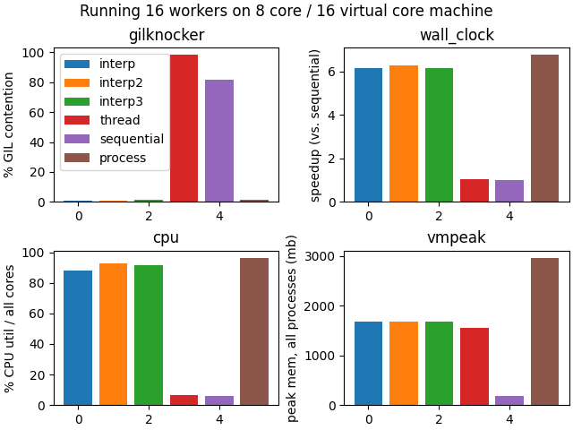

# Pool party 🏊

Experiments with building a `multiprocessing.pool.SubinterpreterPool` out of the
per-interpreter GIL support in Python 3.12.

## Results



Results of running the nbody benchmark using all 16 virtual cores on an 8 core
system. **The choice of benchmark here probably has a considerable impact on the
results. Don't take any of this as definitive. More benchmarks with different
characteristics will need to be tested.**

## Methods

At the core of multiprocessing is a "work handler loop", which receives tasks (a
function and some arguments) from an input queue, and then puts the result in an
output queue.

There are currently two and a half different methods for running this work
handler loop with subinterpreters, all of which have very similar performance in terms
of runtime and memory.

In both cases, subinterpreters are managed using
`Lib/test/support/interpreters.py` which is an experimental implementation of
[PEP 554](https://peps.python.org/pep-0554/).

### Method one

As with regular `multiprocessing` using subprocesses, each worker in the pool has its own thread in the main interpreter.  
Inside each of those threads, a subinterpreter runs multiprocessing's existing "work handler loop", unmodified.  

Since a `queue.SimpleQueue` can not be used to send objects between
subinterpreters, work is sent to this loop inside the subinterpreter using a
`LockableBoard` from the [extrainterpreters
project](https://github.com/jsbueno/extrainterpreters). Objects can be added and
removed from a `LockableBoard` from multiple subinterpreters, and it enforces
that only one subinterpreter can access an object at a time. The object must be
a sharable type, so the objects are pickled/unpickled in order to send back and
forth, but the pickle data itself does not need to be copied.

Since the worker loop needs to block waiting for more tasks and the result
handler needs to block waiting for more results, an `os.pipe` is used to
communicate between interpreters when new data is ready to be read from the
`LockableBoard`.

Experimentally, this was much faster than polling in a Python loop, but I don't
know whether this is the most efficient synchronization primitive for this
purpose (it was definitely handy).

(extrainterpreters also contains a Queue class that is more like what is needed,
but it doesn't appear to support blocking reads yet.)

### Method two

As above, each worker in the pool starts a new thread in the main interpreter.
Each of these threads has exactly one subinterpreter contained in it, but rather
than that subinterpreter running the work handler loop, it remains running in
the thread on the main interpreter, and each task is sent individually to its
subinterpreter.

Since the work handler is just a regular thread, it can use `queue.SimpleQueue`
to receive tasks and return results.

When a task is received from the queue in the worker thread, the task data is
pickled and sent to the subinterpreter using `interpreter.run()`.

A modification to `interpreter.run()` was made (going beyond PEP554) to run code
in `eval` mode, so that a return value can be obtained and returned. For safety,
this enforces that the return value is of a subinterpreter-shareable object. To
support all objects, the code that runs a task inside a subinterpreter returns a
pickled copy of the return value.

Specifically, the following code is run when initializing each subinterpreter:

```python
import pickle

def _f(p):
    func, args, kwargs = pickle.loads(p)
    return pickle.dumps(func(*args, **kwargs))
```

And the following code runs each task, where `pickle` is a `(func, args, kwargs)` triple:

```python
_f({pickle!r})
```

### Method three

This method is identical to method two, except the return value from the
subinterpreter is sent over a pipe back to the worker thread in the main
interpreter. This does not require the extension to PEP554 to run code in eval
mode.

## Running this

This requires:

  - A [branch of CPython that adds a SubinterpreterPool](https://github.com/mdboom/cpython/tree/subinterpreter-pool-memoryboard)
  - A [branch of extrainterpreters that bypasses a safety check](https://github.com/jsbueno/extrainterpreters/compare/main...mdboom:extrainterpreters:main)
  - GNU time installed and on the path

To reproduce these results:

- Checkout the `subinterpreter-pool-memoryboard` branch of CPython from my fork into a directory sitting alongside this one, and build it.
- Use `run.sh $1` to install the dependencies in a venv and run one specific mode:

  - `interp`: SubinterpreterPool using a memoryboard for communication
  - `interp2`: SubinterpreterPool using `queue.SimpleQueue` for communication
  - `thread`: Use the existing `multiprocessing.pool.ThreadPool`
  - `subprocess`: Use the default subprocess-based `multiprocessing.Pool`
  - `sequential`: Don't use multiprocessing at all, just run the same work sequentially

- Use `get_data.py` to collect results from all modes.
- Use `plot.py` to plot the data from `data.json`.
